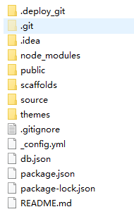

## 博客网站结构
### 前端
&ensp;&ensp;[g29times.github.io](http://example.com/)
	
### 后端
* hexo
 
  * jupiter
   备份hexo生成的.deploy_git发布目录
  * mars
   备份博客源文件source目录
		
			
## HEXO
* 文档
 https://hexo.io/zh-cn/docs/commands.html
* 命令
  * 草稿
   hexo publish \[layout\] \<title\> &ensp;\#发表草稿。
  * 写作
   hexo n "name" &ensp;\#新建文章
   hexo g &ensp;&ensp;&ensp;&ensp;&ensp;&ensp;&ensp;&ensp;\#生成静态网页
   hexo p &ensp;&ensp;&ensp;&ensp;&ensp;&ensp;&ensp;&ensp;\#发表草稿
   hexo s &ensp;&ensp;&ensp;&ensp;&ensp;&ensp;&ensp;&ensp;\#启动服务
   hexo d &ensp;&ensp;&ensp;&ensp;&ensp;&ensp;&ensp;&ensp;\#部署网站 参数：-g 部署之前先生成静态文件。

## Github Banner
https://www.haomwei.com/technology/fork-me-on-github.html
https://segmentfault.com/a/1190000008040387